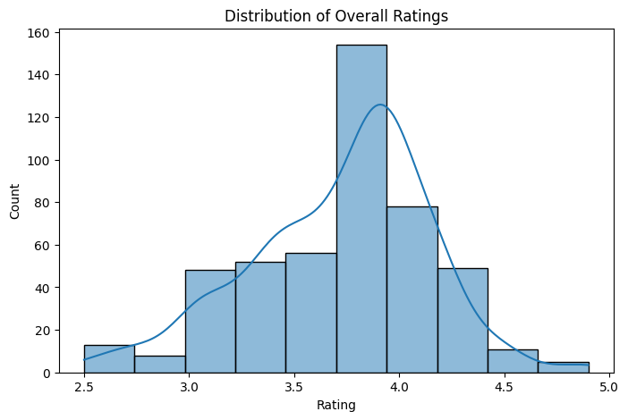
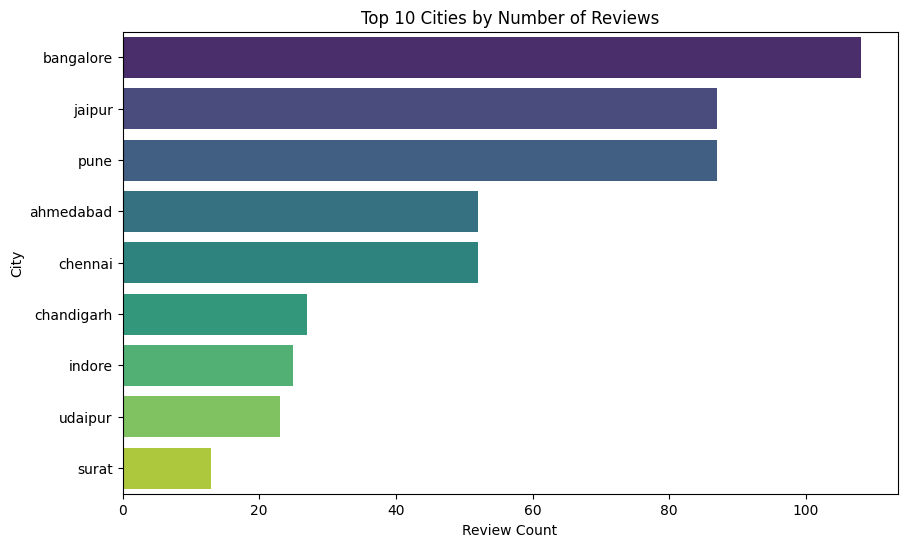
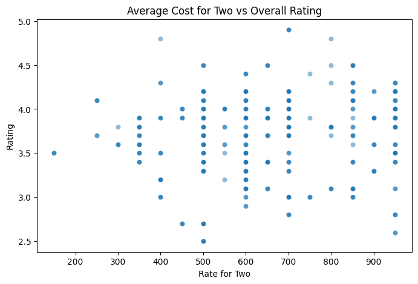
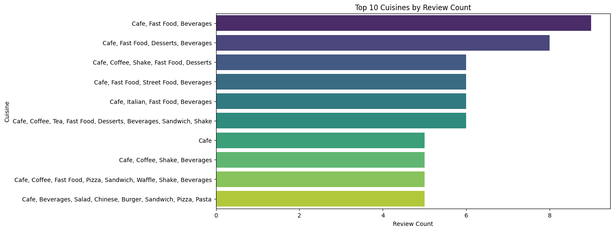
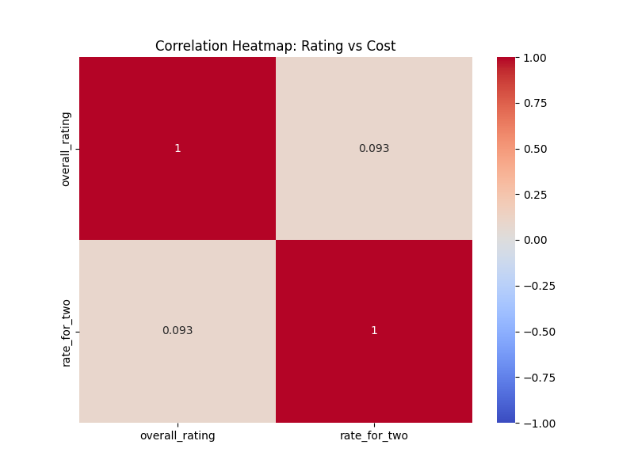

# CafeCritic Recommender  
### Personalized Cafe Recommendations Using Hybrid AI

[](https://python.org)  
[](LICENSE)

----------------------------------------------------------------------------------------------------------

## Live Demo  
**Try it now:** [http://127.0.0.1:5500/](http://127.0.0.1:5500/)  
*(Replace with your Render.com link after deployment)*

----------------------------------------------------------------------------------------------------------

## Project Overview

CafeCritic is a hybrid machine learning recommender system that suggests personalized cafes based on:

- User behavior (via SVD Matrix Factorization)  
- Cafe content (cuisine, city, reviews using TF-IDF)  
- Smart fusion of both (weighted hybrid scoring)

Even with just one rating, it delivers meaningful recommendations.

----------------------------------------------------------------------------------------------------------

## Features

| Feature | Description |
|-------|-----------|
| SVD Model | Predicts missing ratings using latent factors |
| Content-Based | Finds similar cafes using text + metadata |
| Hybrid Engine | Combines SVD + Content for best results |
| Interactive UI | Streamlit app with real-time input |
| EDA Dashboard | Visual insights (rating dist, cost vs rating, etc.) |
| Clean Code | Modular `src/`, reusable `save_plot()` |

----------------------------------------------------------------------------------------------------------

## Tech Stack

ML: SVD Matrix Factorization + TF-IDF Content
 Data: CafeCritic (474 reviews, 180 cafes)
 App: Streamlit
 Viz: Matplotlib + Seaborn
 Deploy: Render.com

----------------------------------------------------------------------------------------------------------

## Project Structure

recommendation-system/
├── app/
│   └── app.py                  Streamlit web interface
├── data/
│   └── processed/cafecritic_processed.csv
├── src/
│   ├── models/
│   │   ├── matrix_factorization.py
│   │   ├── content_based.py
│   │   └── hybrid.py           Main recommender
│   └── visualization/
│       └── plots.py            Save + display plots
├── results/
│   └── figures/                All saved plots
├── notebooks/
│   └── 01_eda.ipynb            Exploratory Data Analysis
├── requirements.txt
├── README.md
└── .gitignore

## Dataset
Download from: https://www.kaggle.com/datasets/juhibhojani/zomato-cafe-reviews?resource=download 
Place the file in: `data/raw/cafecritic.csv`

-------------------------------------------------------------------------------------------------------

## Exploratory Data Analysis (EDA)

The EDA phase provided a quick understanding of the dataset and user–item patterns before building the recommendation engine.

### Dataset Overview
- **Total Records:** 775  
- **Unique Cafes:** 420  
- **Unique Cities:** 12  
- **Average Rating:** 3.8  
- **Sparsity:** ~98% (typical for recommendation datasets)

### Key Insights
- Most ratings fall between **3.5 and 4.5**, showing generally positive user feedback.  
- **Ahmedabad** and **Mumbai** dominate the dataset with the highest review counts.  
- **Cost for two** is moderately correlated with higher ratings.  
- **North Indian** and **Fast Food** cuisines appear most frequently.  

-------------------------------------------------------------------------------------------------------

### Visualizations

Below are the visual summaries generated in the `results/figures/` folder:

####  Rating Distribution


####  Top 10 Cities by Review Count


####  Average Cost vs Rating


####  Top 10 Cuisines


####  Correlation Heatmap (Rating vs Cost)


-------------------------------------------------------------------------------------------------------

### Interpretation
These insights guide model design:
- Collaborative filtering will rely on **user–item interactions**.
- Content-based filtering will leverage **review text and cuisine type**.
- The hybrid model will combine both for improved personalization.

1. SVD ← Learns hidden user/cafe patterns
2. Content ← TF-IDF on reviews + cuisine + city
3. Hybrid ← 70% SVD + 30% Content = 🏆

-----------------------------------------------------------------------------------------------------

---

## How to Run Locally

```bash
# 1. Clone repo
git clone https://github.com/yourusername/cafecritic-recommender.git
cd cafecritic-recommender

# 2. Set up environment
python -m venv venv
venv\Scripts\activate    # Windows
# source venv/bin/activate  # Mac/Linux

# 3. Install dependencies
pip install -r requirements.txt

# 4. Launch app
streamlit run app/app.py