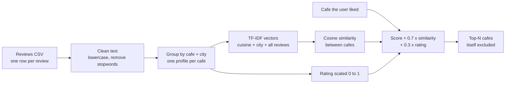

# CafeCritic Recommender

Pick a cafe you liked; CafeCritic suggests similar cafes nearby, ranked by how similar they are (cuisine, city and what reviewers say) and how well rated they are. Built with TF-IDF content similarity and a weighted hybrid score, served through Streamlit.

The more interesting part of this project is what the data allowed. The first version used SVD collaborative filtering. An audit of the data showed it could not work here, and the project was redesigned around that finding (see [What went wrong](#what-went-wrong-and-what-i-changed)).


---

## Contents

1. [Quick start](#quick-start)
2. [Get the real data](#get-the-real-data)
3. [How it works](#how-it-works)
4. [The data](#the-data)
5. [What went wrong and what I changed](#what-went-wrong-and-what-i-changed)
6. [Project structure](#project-structure)
7. [Limitations and next steps](#limitations-and-next-steps)

---

## Quick start

Runs straight from a clone on a small **synthetic** sample (invented cafes), so you can try it without downloading anything.

```bash
git clone https://github.com/jeevanraj-28/cafecritic-recommender.git
cd cafecritic-recommender

python -m venv .venv
# Windows: .venv\Scripts\activate
source .venv/bin/activate

pip install -r requirements.txt
streamlit run app/app.py
```

Open **http://localhost:8501**, choose a city and a cafe you liked, and click **Recommend**. Under **Ranking settings** you can change how much weight goes to similarity versus rating.

Run the tests:

```bash
python -m unittest discover -s tests -v
```

---

## Get the real data

1. Download the [Zomato Cafe Reviews dataset](https://www.kaggle.com/datasets/juhibhojani/zomato-cafe-reviews) from Kaggle (free account needed).
2. Save the CSV as `data/raw/cafecritic.csv`.
3. Clean it (drops rows with missing ratings, names or reviews; removes stopwords):

   ```bash
   python -m src.data.preprocessor
   ```

   This writes `data/processed/cafecritic_processed.csv`. The app uses it automatically from now on.

4. Audit the data and compare rating predictors on a held-out split:

   ```bash
   python scripts/data_audit.py
   ```

   This writes `results/data_audit.md`. For the SVD row, install the extras first: `pip install -r requirements-dev.txt` (on Windows, `conda install -c conda-forge scikit-surprise` is easier).

---

## How it works


```mermaid
flowchart LR
    A[Reviews CSV<br/>one row per review] --> B[Clean text<br/>lowercase, remove stopwords]
    B --> C[Group by cafe + city<br/>one profile per cafe]
    C --> D[TF-IDF vectors<br/>cuisine + city + all reviews]
    D --> E[Cosine similarity<br/>between cafes]
    U[Cafe the user liked] --> F
    E --> F[Score = 0.7 x similarity<br/>+ 0.3 x rating]
    C --> R[Rating scaled 0 to 1] --> F
    F --> G[Top-N cafes<br/>itself excluded]
```

1. **One profile per cafe.** Reviews are grouped by cafe name and city (a chain in two cities is two cafes). Each profile joins the cuisine, the city and every review of that cafe.
2. **TF-IDF.** Each profile becomes a vector where words that are frequent for this cafe but rare overall (for example "filter coffee", "tiramisu") get high weight.
3. **Similarity.** Cosine similarity between profile vectors, from 0 (nothing in common) to 1.
4. **Hybrid score.** `score = alpha x similarity + (1 - alpha) x rating`, with the rating min-max scaled to 0–1 so both parts are on the same scale. The default `alpha = 0.7` favours relevance over popularity. It is a design choice, not a tuned value: the data has no repeat users, so there is nothing to tune it against (see below).
5. **Filter and rank.** The liked cafe is removed, optionally only the same city is kept, and the top N are returned.

---

## The data

From the cleaned Kaggle data, as printed in [`notebooks/01_eda.ipynb`](notebooks/01_eda.ipynb) and [`notebooks/02_collaborative.ipynb`](notebooks/02_collaborative.ipynb):

| Measure | Value |
| --- | --- |
| Reviews after cleaning | 474 |
| Unique cafes | 180 |
| Cities | 9 |
| Rating mean / standard deviation | 3.72 / 0.43 (range 2.5 to 4.9) |
| Reviewer x cafe matrix sparsity | 99.44% |
| Reviewers with 3 or more ratings | 0 |

Run `python scripts/data_audit.py` to reproduce these and see the full breakdown.

---

## What went wrong and what I changed

**Version 1** combined SVD collaborative filtering with TF-IDF similarity (`0.7 x SVD + 0.3 x content`) and reported an SVD RMSE of 0.85. Looking at the data more closely showed three problems.

**1. There are no repeat users.** The "user ID" is the review's row number, and a check for users with 3+ ratings found 0. Every reviewer has exactly one rating, so the user-item matrix has one entry per row. SVD learns a user's taste from their *other* ratings, and here there are none: its predictions reduce to roughly "average rating + cafe effect".

**2. The reported error was worse than guessing.** The ratings have a standard deviation of 0.43, so always predicting the average rating gives an RMSE of about 0.43. An RMSE of 0.85 is roughly twice as bad as that trivial baseline. Version 1 also trained on all the data with no held-out split, so the number was not a fair test either. `scripts/data_audit.py` now compares SVD with two baselines (global average, per-cafe average) on a held-out 20% split.

**3. The rating column is probably the cafe's score, not the reviewer's.** Values like 3.4 and 4.9 look like a cafe's aggregate Zomato rating rather than an individual review score. If so, every review of a cafe carries the same number, and "predict this user's rating" is not a meaningful task. The audit checks this directly: it reports the share of cafes whose rating is identical across all of their reviews.

**Version 1 also had a bug in content similarity.** Similarity was computed between review rows, so a cafe with several reviews could appear several times in one list, and even be recommended for itself (the notebook output shows this). Version 2 builds one profile per cafe first. A unit test checks that a cafe is never recommended for itself and that no cafe appears twice.

**Version 2** therefore answers the question the data can support: *given a cafe you liked, which similar, well-rated cafes should you try?* The SVD code stays in `src/models/matrix_factorization.py`, used only in the audit as an experiment.

**The lesson:** check what the data can support before choosing the model. A quick count of how many ratings each user has would have changed the design on day one.

---

## Project structure

```
cafecritic-recommender/
├── app/app.py                      # Streamlit UI (real data if present, else synthetic sample)
├── src/
│   ├── data/loader.py              # Load the raw Kaggle CSV
│   ├── data/preprocessor.py        # Clean text, drop bad rows, save processed CSV
│   ├── models/content_based.py     # Cafe profiles + TF-IDF cosine similarity
│   ├── models/hybrid.py            # Similarity + rating score
│   ├── models/matrix_factorization.py  # SVD (experiment only, see above)
│   ├── models/collaborative.py     # User/item cosine CF (experiment only)
│   └── evaluation/metrics.py       # RMSE, MAE, precision@k, recall@k
├── scripts/
│   ├── data_audit.py               # Data checks + held-out rating baselines vs SVD
│   └── make_sample_data.py         # Builds the synthetic sample
├── data/sample/cafes_sample.csv    # 153 synthetic reviews, 40 invented cafes
├── notebooks/                      # EDA and model experiments (01 to 05)
├── tests/test_models.py            # 11 unit tests
├── requirements.txt                # App and tests
└── requirements-dev.txt            # Notebooks and scikit-surprise
```

---

## Limitations and next steps

- **No offline ranking metric yet.** With no repeat users there is no held-out "next cafe a user liked" to measure precision@k against. A fair proxy would be review-level: split each cafe's reviews into two halves, build profiles from one half, and check whether the other half retrieves the same cafe.
- **`alpha` is not tuned**, for the same reason.
- **TF-IDF matches words, not meaning.** "Cozy" and "warm ambience" do not match. Sentence embeddings would fix this.
- **Small data:** 180 cafes in 9 cities, so some cities have few options.

**Next steps**

- [ ] Review-split retrieval evaluation (above) to compare TF-IDF with sentence embeddings
- [ ] A dataset with real repeat users (for example Yelp) to make collaborative filtering meaningful
- [ ] "Because you liked X" explanations showing the shared top TF-IDF terms

---

## Author

**Jeevan Raj M** · [LinkedIn](https://linkedin.com/in/jeevan-raj-m-5ba64a383) · [GitHub](https://github.com/jeevanraj-28) · [Portfolio](https://jeevanraj-28.github.io)
